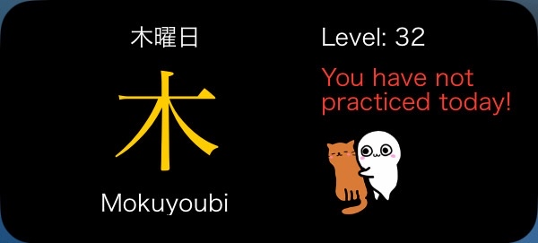
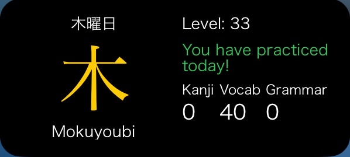

# Renshuu-iOS-Widget
A minimalist iOS Home Screen/Lock Screen widget built with [Scriptable](https://scriptable.app) that helps you stay consistent with your Japanese language learning via [Renshuu.org](https://www.renshuu.org/).

## Widget Preview

  
   
  

 

---

## Features

- Displays the current day of the week in Japanese (e.g. 水曜日 for Wednesday)
- Displays your Renshuu Level
- Tracks if you’ve practiced today on [Renshuu](https://www.renshuu.org/)
- Shows number of kanji, vocabulary and grammar words you've studied today (if any)

---

## Requirements

- iOS 14+
- [Scriptable](https://apps.apple.com/app/scriptable/id1405459188)
- A free or premium [Renshuu.org](https://www.renshuu.org/) account
- Your **Renshuu API key** (from settings on Renshuu)

---

## Setup Instructions

1. **Install Scriptable** from the App Store.
2. **Get your Renshuu API key:**
   - Log in at [renshuu.org](https://www.renshuu.org)
   - Go to **Settings > External Access**
   - Generate or copy your API key
3. **Import the Script:**
   - Open Scriptable → Tap `+` → Paste code from `widget.js`
   - Replace the placeholder `API_KEY` in the script with your actual Renshuu API key
4. **Add the widget to your Home Screen:**
   - Long press the screen → `+` icon → Select Scriptable
   - Choose the widget size (Small or Medium)
   - Tap and hold the widget → "Edit Widget"
   - Under *Script*, select your script (e.g. `RenshuuWidget`)
   - Create the contents of your widget!
  
